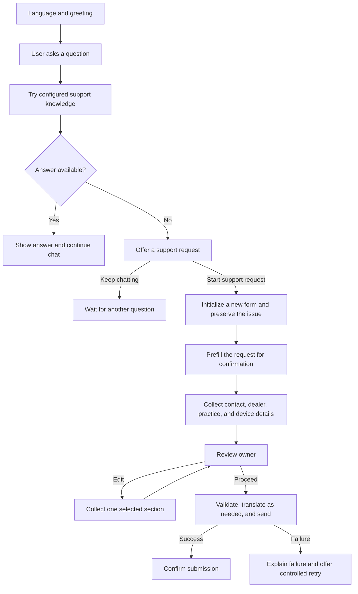

# Answer first, then offer the support form

This is a proposed design for the supplied agent. It is not an installed topic or a replacement for the saved source. The orchestration mode, knowledge settings, and existing Conversational boosting/Fallback topics must be inspected in Copilot Studio before implementing it.

## Intended experience

The language selector is followed by a greeting such as:

> Hello! Describe your issue or ask a question. I'll try to help, and if I can't find an answer, I can help you submit a support request.

The user then asks a normal question. Try the configured support knowledge. If an answer is available, respond and continue the conversation. If no answer is available, explain that and offer Start support request or Keep chatting. A user who explicitly asks to contact support can enter the form directly. Preserve the user's issue when entering the form.



An AI response being present is not proof that the user's problem is resolved. Optionally offer support after an answer if the user says it did not help. Do not use an AI-written phrase such as "I don't know" as the control condition.

## Connect the missing entry point

Microsoft documents the usual sequence as authored intent matching, then generative answers, then Fallback if neither can handle the query. That provides a natural place to offer the form after an unsuccessful knowledge answer. [Generative answers as a fallback](https://learn.microsoft.com/en-us/microsoft-copilot-studio/nlu-boost-node).

**When the existing agent already performs this sequence:** Keep ConversationStart focused on language and greeting. Modify the real Fallback topic to offer support and redirect to InternationalFormWorkflow. Verify that knowledge answering runs before Fallback and that no broad form-entry topic wins every question first.

**When a deterministic custom answer path is needed:** Capture the incoming question, run a Create generative answers node with the intended sources, save the answer output, and explicitly branch on the saved result. Use a text answer output for an `IsBlank(Topic.Answer)` condition. If the node is configured to return a complete record, inspect its actual text field instead of checking a whole record as though it were a string. Microsoft publishes a text-output example using `SearchAndSummarizeContent`, `System.Activity.Text`, and `!IsBlank(Topic.Answer)`. [Code editor example](https://learn.microsoft.com/en-us/microsoft-copilot-studio/guidance/topics-code-editor).

Choose one owner of the no-answer decision. Calling Fallback from an answer path and independently redirecting from Fallback can produce duplicate offers. A connector/search error should take a handled error route rather than being mistaken for a normal empty search result.

If your requirement is specifically to answer from support documentation, configure that source scope deliberately. Broad web/general knowledge can produce an answer even when the support sources have none. Selected sources can replace the node's agent-level sources; confirm this in the node properties. [Knowledge-source scope](https://learn.microsoft.com/en-us/microsoft-copilot-studio/nlu-boost-node).

## Preserve the issue before prompting

At the entry handling the real support question, copy its text to a dedicated variable before displaying any consent question or card. For a route using the current user message, the assignment is:

```powerfx
Global.PendingSupportQuestion = System.Activity.Text
```

Set this using a Set variable node; the expression above illustrates the intended source and destination. In routes where the current activity has changed, use the retained triggering message or captured issue instead. The value must be the user's support question, not the language choice, Start support request click, or feedback reply.

Offer stable submit data such as `startSupportForm` and `keepChatting`. On `startSupportForm`:

1. Initialize new-form state, including a Boolean such as `Global.FormInProgress = true`.
2. Clear the previous form's fields, review action, feedback, translated outputs, and submission status while retaining the selected language and pending question.
3. Assign the captured question to `Global.UserRequest`.
4. Enter InternationalFormWorkflow.

Use new-form initialization only here. Reentering a collection section to edit it must not clear the draft. Initialize control variables explicitly before reading them, including FormInProgress, to avoid empty-value initialization surprises.

The existing UserRequest card has no default value. Convert it to a formula card and use its Input.Text `value` to prefill `Global.UserRequest`. Ask the user to confirm or improve that issue description. Alternatively, skip the request step when a confirmed description is already present. Do not make the user type the original question again.

## Guard against form reentry

Before Fallback offers a new form, check whether a form is already active. If it is, handle the interruption as help, resume, cancel, or restart rather than launching another form. Preserve the draft through ordinary interruptions. On explicit cancellation, completion, or failure paths where the draft is abandoned, clear FormInProgress deliberately.

Feedback must return to its caller or end normally; remove its unconditional Fallback redirect. Otherwise a form-entry Fallback can treat the feedback as a new support issue.

## Simplify the review ownership

The parent/review owner should repeat this sequence without recursive BeginDialog chains:

```text
show review -> inspect stable action
  reviewEdit    -> pick one valid section -> collect it -> return to review
  reviewProceed -> validate required data -> continue to submission
  cancel        -> end the draft intentionally
  other         -> explain and redisplay the current review
```

Use Studio's loop/go-to-step or an equivalent supported topic arrangement to return to the review node. Collection topics should end after saving their section. Remove their helper1 review redirects when adopting this design. The editor should return rather than reopening review internally. This removes the need for FirstTimeFormState to control review from every section.

## Connect submission deliberately

The current email schema includes written feedback. There are two valid designs:

- Collect optional feedback with an explicit Skip before translation/email, if it must be included in that email. Feedback returns to the submission owner and does not invoke Fallback. A skipped field becomes an empty string.
- Submit the support request first and ask for optional feedback afterward. In that design, map `text_14` to an empty string for the support email and store/send later feedback separately. Do not make the user complete feedback to send their request.

For either design, validate the final required fields, keep original and translated text separately, map flow inputs explicitly, skip blank feedback translation, and handle backend failure. Confirm success only after the email flow succeeds. The demo card can remain the final step while the backend is being tested.

## Acceptance checks

| Scenario | Expected outcome |
| --- | --- |
| Known support question | Knowledge answer; no forced form |
| Unknown support question | One offer to start support request |
| User declines form | Return to chat without a new draft |
| User asks to contact support | Direct form entry with available context |
| User accepts after no answer | Original issue is prefilled, not the acceptance message |
| Blank/missing knowledge response | Form offer through the chosen no-answer route |
| Knowledge search errors | Explicit recovery; no claim that support knowledge lacks an answer |
| User says answer did not help | Form remains available |
| Help question during a form | Answer/resume or explicit cancel; no nested new form |
| Edit, cancel edit, and Proceed | Exactly one review confirmation before submission |
| Feedback or Skip | Normal completion; no Fallback/new form |
| Second request in the same session | Fresh fields and state; retained language if intended |
| German/Spanish/Chinese/Japanese/Korean | Localized text with identical routing IDs |
