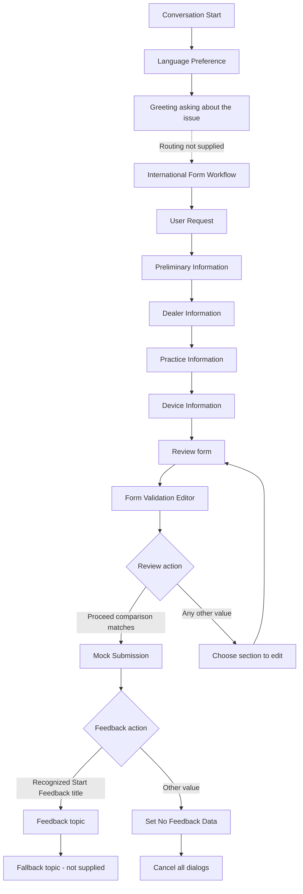

# Current flow

This describes the supplied snapshot, not verified behavior of a published agent. The complete AI routing configuration and action definitions were not supplied.

## Conversation start

1. `topic0.ConversationStart` runs on `OnConversationStart`.
2. It calls `brandon_Agent09232026.topic.wf1.LanguagePreferenceCopy`, represented by `topic1.LanguagePreference.yaml`.
3. LanguagePreference asks a closed-list question, maps the answer to `System.User.Language`, and returns the selected option to `Global.UserLanguage`.
4. The start topic sends the greeting asking the user to describe the issue, then reaches the end of its actions.

The greeting is a message, not a question node that stores the reply. The next user message is handled by whatever orchestration, topics, and knowledge configuration exists outside this snapshot. No supplied topic calls `InternationalFormWorkflow`, and no supplied topic attempts a generative answer. Therefore the desired answer-first, form-if-unanswered behavior is not established by these snippets.

## Main form sequence

`InternationalFormWorkflow` has `OnRedirect` and `startBehavior: CancelOtherTopics`. When entered, it executes these topics in order:

The diagram simplifies call-and-return behavior. The picker currently fails to match the returned section values. If that mismatch is fixed alone, edited sections also open a nested review through helper1, before the editor opens another review. See the review document for the full return-stack problem.

## Collection topics

| Supplied topic | Internal suffix | Values stored | Required on card |
| --- | --- | --- | --- |
| form1.UserRequest | `wf2.UserRequest` | `Global.UserRequest` | Issue or question |
| form2.PreliminaryCheck | `wf3.PreliminaryCheck` | `contactName`, `contactEmail`, `caseNumber`, `airTechniquesContact` | Contact name, email |
| form3.DealerInfo | `wf4.DealerInfo` | `dealerName`, `dealerBranch`, `dealerPhone`, `dealerAddress` | None |
| form4.PracticeInfo | `wf5.PracticeInfo` | `practiceName`, `practicePhone`, `practiceAddress` | All three |
| form5.DeviceInfo | `wf6.DeviceInfo` | `deviceModelOrPartNumber`, `deviceSerialNumber` | Both |

All field variables in the table are global. PreliminaryCheck stores its submit identifier globally; the other collection topics use topic-scoped submit identifiers. Each collection topic calls `helper1.FormValidationCondition` and then ends.

The email card regex checks a basic email shape. The phone, address, model, and serial fields primarily check presence through card requirements; the supplied topics do not perform a separate business-validation pass.

## Review and editing

`form6.FormValidation` uses a Power Fx card to read global values into FactSets. Its `If(IsBlank(...), "", ...)` expressions substitute empty display strings; they do not validate the data. Proceed and Edit have titles but no stable explicit submit data. The resulting `actionSubmitId` is bound to `Global.formValidation`.

`helper2.FormValidationEditor` always sets `Global.FirstTimeFormState` to `false` before checking the action. If the action equals the English string `Proceed`, it does nothing else and ends implicitly. Otherwise it asks which section to edit.

The editor's ChoiceSet submits `request`, `preliminary_info`, `dealer_info`, `practice_info`, or `device_info`. Its routing conditions compare `Request`, `Preliminary Info`, `Dealer Info`, `Practice Info`, or `Device Info`, so the edit redirects do not match those submitted values. ApplyEdits with no selection also has no useful handling. Cancel and unmatched selections eventually open the review again.

`helper1.FormValidationCondition` opens review whenever `Global.FirstTimeFormState = false`. The supplied code never initializes this variable to `true`. After any review it remains `false`, including when a second form starts in the same session.

## Mock completion and feedback

`form7.FormSubmission` shows a mock submission and waits for Start Feedback or End Demo. It does not call a submission action. Feedback routing compares a list of seven translated button titles. Any other value writes the literal `No Feedback Data`.

The feedback redirect targets `brandon_Agent09232026.topic.wf9dev.Feedback`. The supplied `helper4.Feedback` is treated as its likely implementation for this review; the snippet does not declare its own schema name, so that identity must be checked in Studio.

Feedback uses `OnSystemRedirect`, `CancelOtherTopics`, and an interruptible string question. It stores `Global.feedbackData`, turns a trimmed English `skip` into an empty string, thanks the user, and explicitly redirects to the missing Fallback topic. This is a real redirect, rather than waiting for a later unanswered support question. Depending on Fallback's implementation, it could reopen troubleshooting or a new form.

The main workflow eventually uses `CancelAllDialogs` on the ordinary return path. Ending topics does not clear globals; Microsoft documents this distinction in [Manage topics](https://learn.microsoft.com/en-us/microsoft-copilot-studio/authoring-topic-management).

## Translation helper and flow

`helper3.TranslateToEnglish` is not called anywhere in the supplied topics. If called, it checks the selected user locale. English does nothing. For another locale, it calls `InternationalFormTranslation` with `input: {}`, binds request and feedback outputs, then replaces the original `Global.UserRequest` and `Global.feedbackData` with translated text.

The translation flow:

1. Requires string inputs `text` (UserRequest) and `text_1` (Feedback).
2. Translates the request into English using Microsoft Translator V2.
3. Translates feedback after the request translation succeeds.
4. Responds only after feedback translation succeeds, with `userrequest` and `feedback`.

The action wrapper that supplies inputs was not included. The empty call input does not demonstrate any mapping from the global variables. Microsoft Translator V2's Translate operation returns a string, so using the translation action bodies as string outputs is consistent with the documented connector; an array/object extraction fix is not indicated here. [Connector reference](https://learn.microsoft.com/en-us/connectors/translatorv2/).

## Email helper and flow

`helper5.EmailWorkflow` is also not called anywhere in the supplied topics. If called, it redirects to the missing Signin topic and then calls `InternationalFormEmail`, without explicit input bindings in this snippet.

The email flow:

1. Requires all 15 properties `text` through `text_14` to be present as strings.
2. Sends an HTML email to `brandon.chin@airtechniques.com`, with the user-entered contact email in Cc.
3. Uses the case number in the subject and inserts all supplied fields directly into HTML.
4. Returns an empty success response only after SendEmailV2 succeeds.

| Flow key | Field / global source when connected |
| --- | --- |
| `text` | `Global.UserRequest` or a separate English request variable |
| `text_1` | `Global.contactName` |
| `text_2` | `Global.contactEmail` |
| `text_3` | `Global.caseNumber` |
| `text_4` | `Global.airTechniquesContact` |
| `text_5` | `Global.dealerName` |
| `text_6` | `Global.dealerBranch` |
| `text_7` | `Global.dealerPhone` |
| `text_8` | `Global.dealerAddress` |
| `text_9` | `Global.practiceName` |
| `text_10` | `Global.practicePhone` |
| `text_11` | `Global.practiceAddress` |
| `text_12` | `Global.deviceModelOrPartNumber` |
| `text_13` | `Global.deviceSerialNumber` |
| `text_14` | `Global.feedbackData` or separate English feedback |

This is a proposed mapping based on field names; it is not present in the saved helper call.

## Missing context

- Fallback, Conversational boosting, Signin, and any topic that enters the main form.
- Agent orchestration mode, instructions, knowledge sources, enabled topic status, and channels.
- Secondary language configuration and localization files.
- Global variable definitions and empty-value initialization settings.
- Tool/action definitions connecting the topic calls to the two backend flows.
- Full flow containers, connection references, and runtime settings. Individual steps are saved, not synthesized into an export.
